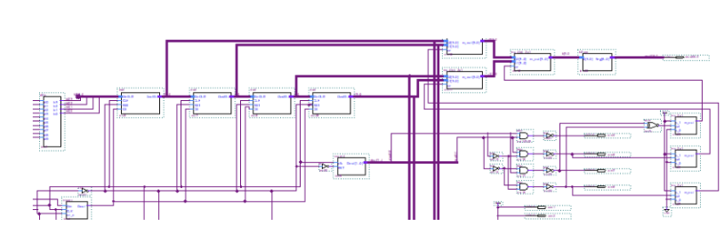
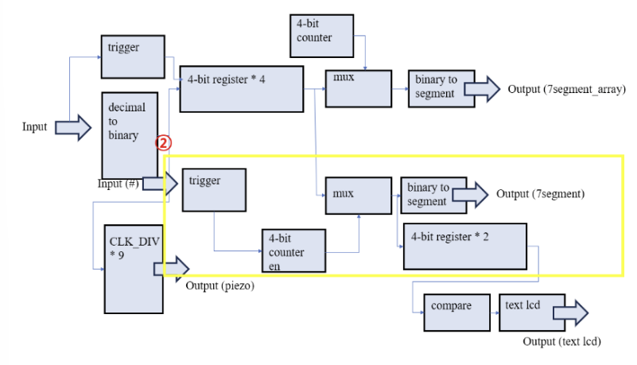

# FPGA Elevator Simulator

## 📘 Term Project Final Report

- **과목명**: 논리회로 설계 및 실험   

---

## 🛠️ 구현 결과

### 1. 숫자 입력받기
- 가고 싶은 층 수를 **4개까지 입력**합니다.
- 입력된 층 수는 **7-segment array의 마지막 4자리로 표시**됩니다.
  
### 2. 닫힘 버튼 누르기
- `# 버튼`(닫힘 버튼)을 누르면 **목표 층으로 이동**을 시작합니다.

### 3. 상황 표시

#### ✅ 현재 층 수
- 현재 층 수는 **7-segment (단독)**으로 표시됩니다.
  

#### 🔼🔽 현재 상황 (Up/Down)
- **올라가고 있는지 또는 내려가고 있는지**를 Up/Down으로 출력합니다.
  

### 4. 기타 모듈 - 버튼 누를 시 소리
- 각 층 수를 누를 때마다 소리가 납니다.
- 1부터 9까지 입력 시, 각각 도, 레, 미… 등 **한 음씩 높아지는 소리**로 구현하였습니다.

---

## 🔧 구현 방법

### 전체적인 구조도
> 입력 → 인코딩 → 저장 → 출력 → 피드백의 흐름으로 구성된 디지털 회로 기반 시뮬레이터

---

### 2-1. 구현 세부사항

#### 📍 7-segment Array - 목표층 표시

- 입력을 **decimal → binary → 4bit 인코딩**.
- 인코딩된 값은 4개의 레지스터에 저장됨.
- **trigger 신호**에 반응하여 저장 및 업데이트.
- **4bit counter**와 **MUX**로 순차적 출력.

#### 📍 7-segment (단독) - 현재 층 표시

- 4개의 레지스터에 저장된 값을 활용.
- `# 버튼`이 눌렸을 때만 **counter 증가 → MUX → 층 출력**.
- 예: 2 → 3 → 5 → 7 누르고 `#` 버튼 누를 때마다 출력 갱신됨.

#### 📍 Text LCD - 상승/하강 방향 표시

- 현재 층과 목표 층을 비교하여 **UP / DOWN**을 텍스트로 표시.
- trigger가 활성화될 때 레지스터의 shift를 통해 이전값과 비교하여 판단.

#### 📍 Piezo - 소리 출력

- 분주값을 기반으로 도, 레, 미… 등의 음을 구현.
- 층수(1~9)에 따라 각각 다른 소리를 출력하여 클릭 피드백 제공.

---

### 2-2. 모듈 구현

- **4-bit Compare (Enable 버전)**: 기존 counter에 enable 신호 추가 → trigger=1일 때만 증가
- **Compare Module**: 현재 층과 목표 층을 비교하여 상승/하강 판단
- **Text LCD (Verilog)**: 비교 결과를 바탕으로 UP/DOWN 출력
- **기타 재사용 모듈**: `decimal_to_binary`, `trigger`, `CLK_DIV`, `register`, `binary_to_segment` 등 수업 내용 재활용

---

### 2-3. 전체 회로
> 전체 회로는 입력 처리, 상태 판단, 출력 피드백 흐름에 따라 모듈이 체계적으로 연결되어 구성되어 있음

---

## 🔄 구현 변경된 내용

- **Piezo 추가**: 원래 계획에는 없었으나, **사용자 클릭 피드백**과 **직관성 강화**를 위해 추가.
- **엘리베이터 상태 표시 방식 변경**:
  - 원래는 자동 상태 갱신을 목표했으나, **Clock 타이밍 복잡성**으로 인해 trigger 기반 방식으로 전환.
  - `# 버튼` 입력 시에만 상태 판단 및 표시가 이루어지도록 설계함.
  - 이는 **trigger 모듈 응용**을 통해 구현되었으며, 수업에서 배운 내용을 실제로 적용한 좋은 사례임.

---

## 🎯 기존 계획 대비 완성도

- 비록 계획의 일부는 변경되었지만, **핵심 기능은 모두 충실히 구현**됨.
- 목표 층 입력 → 7-segment 표시 → 닫힘 버튼 누르면 이동 시작 → 현재 층 표시 및 방향 안내 → 층마다 소리 출력 등 **전체 흐름이 자연스럽고 직관적으로 작동**.
- Piezo를 통한 확장성 확보, trigger 응용을 통한 실용적 제어 방식 도입 등에서 **높은 창의성과 학습 효과**를 얻을 수 있었음.
- 이번 프로젝트는 단순한 논리 회로 설계를 넘어서, **실제 시스템 구현 경험을 쌓을 수 있는 의미 있는 기회**였음.

---
